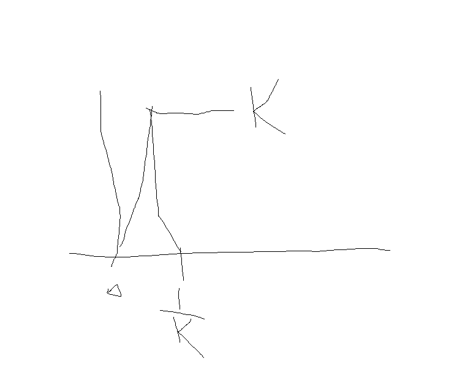

## Theorem
Let $f\ge 0$ be measurable on $E$, then $\int_E fdx=\sup_{}(\inf_{E_j}f(x))|E_j|$, where the supremum is taken over any $E=\cup_{j}E_k$ into a finite union of disjoint $E_j$

#### proof.
1. Let $E=\cup_j E_j$ be any decomposition of $E$(disjoint union), then $0\le \sum_j \inf_{E_j} f(x)\chi_{E_j}\le f(x)$ on $E$.

Hence, $\int \sum_j (\inf_{E_j} f)\chi_{E_j}dx=\sum_{j}(\inf_{E_j} f)|E_j|\le \int_E fdx$
$\implies \sup \sum_j (\inf_{E_j} f)|E_j|\le \int_E fdx$

to prove the opposite inequality, let's consider $E_j^{(k)}=\{ \frac{j-1}{2^k}\le f(x)< \frac{j}{2^k} \}$, $j=1,2,...,k2^k$

Hence $\sum_{j=0}^{k2^k} (\inf_{E_j^{(k)}} f)\chi_{E_j^{(k)}}\to f(x)$ as $k\to\infty$

By the monotone convergence theorem, we have $\sup \sum_j (\inf_{E_j} f)|E_j|\ge \int_E \sum_{j=0}^{k2^k} (\inf_{E_j^{(k)}} f)\chi_{E_j^{(k)}} \to \int_E fdx$

## Theorem
1. if $f\ge 0$ and $|E|=0$, then $\int_E fdx=0$
(can be directly proved by preceed theorem)
2. if $f\ge 0$ and $\int_E fdx=0$, then $f=0$ a.e.

# Convergence theorems
Goal: we want that if $f_k\to f$ a.e. on $E$, then $\int_E f_kdx\to \int_E fdx$
This statement is not true without additional assumptions
#### example
$f_k(x)$ is constructed as follow:

$\int_E f_kdx=\frac 12 \times k\times \frac 1k=\frac 12$

However, $f_k\to 0$ a.e. as $k\to\infty$

Hence, $\int_E f_kdx\not\to 0$

## Theorem [Fatou's Lemma]
Let $f_k$ be a sequence of **nonnegative** measurable functions, then
- $\int_E \liminf f_k dx\le \liminf \int_E fdx$

#### remark
The example given here shows that the strict inequality holds.

#### proof.
recall that 
- $f(x)=\liminf_{k\to\infty} f_k(x)=\sup_k \inf_{j\ge k} f_j(x)$ is measurable

define $g_k(x)=\inf \{f_k(x), f_{k+1}(x),...\}$ then $0\le g_k\to f$ increasingly a.e.

by the monotone convergence theorem, $\int_E gdx\to \int_E fdx= \int_E \liminf f(x)dx$

note that $0\le g_k(x)\le f_k(x)\forall k,$ hence $\int_E f_k(x)\ge \int_E g_k(x)dx$

$\implies \liminf \int_E f_kdx \ge \liminf \int_E g_kdx=\lim \int_E g_kdx=\int_E \liminf fdx$

## Theorem [Lebesgue's dominated convergence theorem]
Let $\{f_k\}$ be a sequence of nonnegative measurable functions and $f_k\to f$ a.e. on $E$.

Assume that there exist a measurable function $\phi$ satisfy $f_k(x)\le \phi(x)$ a.e. on $E$ $\forall k$, and $\int_E \phi dx < \infty$, then 
- $\int_E f_kdx\to \int_E fdx$

#### proof.
Let $g_k=\phi-f_k$, then $g_k\ge 0$ and $g_k\to \phi-f$ a.e.
by Fatou's Lemma,
- $\int_E \liminf g_kdx\le \liminf \int_E g_kdx$
$\implies \int_E \lim_{k\to\infty} g_kdx=\int_E \phi-fdx=\int_E \phi dx-\int_E f dx$
$\le \liminf \int_E (\phi -f_k)dx=\int_E \phi dx - \limsup \int_E f_kdx$
$\implies \limsup_k \int_E f_k dx\le \int_E fdx=\int_E \lim_k f_kdx=\int_E \liminf f_kdx \le \liminf \int_E f_kdx$
Therefore, the converse side of Fatou's Lemma also hold, and therefore the equality hold.
Hence, we prove the theorem.

# Lebesgue integral for a general function
## Def.
Let $f$ be measurable on $E$, $\int_E fdx = \int_E f^+ dx - \int_E f^- dx$
provided one of then is finite.
