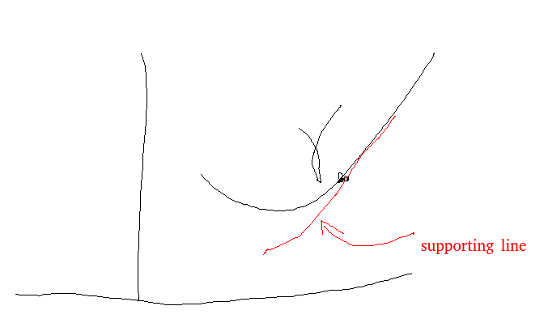

## Theorem
if $\phi$ is convex in $(a,b)$, then it's Lipchitz in $(a,b)$.
in fact, it satisfies the Lipchitz condition at every closed intervals in $(a,b)$
since it is Lipchitz (and therefore a.c.)
$\forall x_1,x_2\in (a,b),x_1<x_2$, we have
$\int_{x_1}^{x_2} \phi ' = \phi(x_2) - \phi(x_1)$

proof.
Let $x_1 \le y < x \le x_2$
$D^+ \phi(y) \le \frac{\phi(x)-\phi(y)}{x-y} \le D^- \phi(x)$

both $D^+ \phi(y),D^-(x)$ are monotone increasing

$\implies |\frac{\phi(x)-\phi(y)}{x-y} |\le \max\{ |D^+\phi(x_1)|, |D^- \phi(x_2)|\}$

$\implies \phi$ is Lipchitz

## Theorem(Jenson's inequality)

Let $f$ and $p$ be measurable functiobs, finite a.e. in $A\subset \mathbb R^n$.
Suppose that $fp$ and $p$ are integrable on $A$, $p\ge 0$ and $\int_A p > 0$
if $\phi$ is convex function in the range of $f$, then
$\phi (\frac{\int_A fp}{\int_A p})\le \frac{\int_A \phi(f) p}{\int_A p}$

proof.

Since $f$ is inite a.e. in $A$, we can assume $range(f) \subset (a,b)$

note that
- $a=\frac{a\int_A p}{\int_A p} \le \frac{\int_A fp}{\int_A p} \le \frac{b\int_A p}{\int_A p} = b$

so, let $\gamma = \frac{\int_A fp}{\int_A p}$, then $\gamma \in (a,b)$

Let $m$ be the slope of the supporting line(i.e. 切線) at $\gamma$ and $t\in (a,b)$, then by convexity,
- $\phi(\gamma) + m(t-r)\le \phi(t)$

Hence,
- $\phi(\gamma) + m(f(x)-\gamma) \le \phi(f(x))\implies \int_A p(x) \phi(\gamma) + m\int_A p(x)(f(x)-\gamma) \le \int_A \phi(f(x))p(x)$

Note that
- $\int_A p(x) f(x) - \int_A p(x)\gamma = 0$ ($\gamma = \frac{\int_A fp}{\int p}$)
- $\implies \phi(\gamma) \le \frac{\int_A \phi(f) p}{\int_A p}$ i.e. $\phi(\frac{\int_A fp}{\int_A p})\le \frac{\int_A \phi(f)p}{\int_A p}$

# Abstract Integration
Let $f\in L(\mathbb R^n)$, define $\forall E$ measurable(Lebesgue), Let
- $\lambda(E) = \int_E f dx$

$-\infty < \lambda(E) <+\infty$ for all $E\in \Sigma$, where $\Sigma$ is the Lebesgue $\sigma-algebra$

Also,m $\lambda(E)$ satisfies countable additivity.
that is, if $\{E_k\}_{k=1}^\infty$ are disjoint measurable subsets, then $\lambda(\cup_k E_k) = \sum_k \lambda(E_k)$

## Def. (Additive set function / finite signed measure)
Let $\Omega$ be a given set and $\Sigma$ be a $\sigma-algebra$ of $\Omega$
A real-valued function $\lambda$, defined on $\Sigma$, is called an additive set function on $\Sigma$ if it satisfies
- 1. $\lambda(E)$ is finite
- 2. [countable additivity]
    if $\{E_k\}_{k=1}^\infty$ are disjoint measurable sets, then $\lambda(\cup_k E_k) = \sum_k \lambda (E_k)$

#### remark of ii.
since $\cup_k E_k$ is independent of order, the RHS is understood that the series $\sum_{k=1}^\infty \lambda(E_k)$ converges absolutely.

#### example.
1. $\lambda(E) = \int_E fdx, f\in L(\mathbb R^n)$
2. Let $\Omega = \{x_k\}_{k=1}^\infty$ and $\{a_k(\ge 0)\}_{k=1}^\infty$, the $\sigma-algebra$ of $\Omega$ is the collection of all subsets of $\Omega$ (called $2^\Omega$)
define $\lambda(E) = \sum a_{{k_j}}$ if $E=\{x_{k_j}\}$,
Here $(\Omega, \Sigma, \lambda)$ defined a discrete measure space, and $\lambda$ is a measure.
(Not additive set functions because $\lambda(E)$ can be $\infty$)

#### remark
Recall that if $\mu$ is a measure and $E_1\subseteq E_2$, then $\mu(E_2-E_1) = \mu(E_2)-\mu(E_1)$ provided $\mu(E_1)<\infty$

However, if $\lambda$ is an additive set function, then $\lambda(E_2-E_1)+\lambda(E_1)=\lambda(E_2)\implies \lambda(E_2-E_1)=\lambda(E_2)-\lambda(E_1)$

So, $\lambda(\emptyset)=0$ for any addinitve set function.

## Theorem
If $E_k\to E$ increasingly, i.e. $E_1\subseteq E_2\subseteq \ldots \subseteq E$ and $E-E_k\to \emptyset$

then
$\lim_{k\to\infty} \lambda (E_k)=\lambda(E)$

similarly, if $E_k\to E$ decreasingly, then $\lim_{k\to\infty} \lambda(E_k)=\lambda(E)$

proof.
Let $A_1=A_2, A_2=E_2-E_1,...$
$\cup_k E_k = \cup_k A_k$, $A_k$ disjoint

then
$\lambda(\cup_k E_k)=\lambda(\cup_k A_k) = \sum_k \lambda(A_k) = \sum_k \lambda(E_k-E_{k-1}) = \lambda(E_1)+[\lambda(E_2) - \lambda(E_1)] +[\lambda(E_3)-\lambda(E_2)]+\ldots$

similar argument for $E_k\to E$ decreasingly

### Corollary
Let $\{E_k\}$ be any sequence of measurable sets, then $\lambda(\liminf_k E_k) \le \liminf_k \lambda(E_k) \le \limsup_k \lambda(E_k) \le \lambda(\limsup_k E_k)$

Recall $\liminf_k E_k = \cup_{k=1}^\infty \cap_{m=k}^\infty E_m$, $\limsup_k E_k=\cap_{k=1}^\infty \cup_{m=k}^\infty E_m$

### Decomposition of an additive set function
1. Recall if $f\in L(\mathbb R^n)$
m then $\lambda(E) = \int_{E\cap \{f\ge 0\}} f^+ dx - \int_{E\cap \{f\le 0\}} f^- dx$
$=\int_E f^+ dx - \int_E f^- dx$

2. if $\mu_1,\mu_2$ be finite measures, then
    $\lambda(E)=\mu_2(E) - \mu_1(E)$
    is an additive set function. can we prove the converse?
    That is , for a given $\lambda$ additive set function, can we write $\lambda = \mu_2 - \mu_1$ where $\mu_1,\mu_2$ finite measurable?
    
-    Given $E\in \Sigma,$ the collection of $E\cap A$ with A ranging over $\Sigma$ forms a $\sigma-algebra$ $\Sigma'$ of subset pf $E$.
So, if $\lambda$ is an additive set function defined on $\Sigma$, then its restriction to $\Sigma'$ is also an additive set function.

## def.
Let $\lambda$ be an additive set function on $\Sigma$, for $E\in \Sigma$ define 
- $\bar V(E) = \bar V(E,\lambda) = \sup_{A\subseteq E,A\in \Sigma} \lambda(A)$ is the upper variation of $\lambda$ on $E$

- $\underline V(E) = \underline V(E,\lambda) = -\inf_{A\subseteq E,A\in \Sigma} \lambda(A)$ is the lower variation of $\lambda$ on $E$

$V(E) = \bar V(E) + \underline V(E)$ is the total variation of $\lambda$ on $E$.

#### remark
1. all three are nonnegative since $\lambda(\emptyset) = 0$
2. also, if $E_1\subseteq E_2$ then $\bar V(E_1)\le \bar (E_2)$, and so as kiwer variation
So, all three are monotone increasing.
Aim: show that $\lambda(E) = \bar V(E) - \underline V(E)\forall E\in \Sigma$, and both $\bar V$ and $\underline V$ are finite measure (Jordan decomposition)

#### Lemma
$\bar V, \underline V$ are countably subadditivity. i.e. if $E_k\in \Sigma\forall k-1,2,...$, $\bar V(\cup_k E_k) \le \sum_k \bar V(E_k)$
(and the same inequality hold for $\underline V, V$)

proof.
Let $A_1=E_1,A_2=E_2-E_1,A_3=E_3-(E_2\cup E_1),\ldots$
then $\{A_k\}$ are disjoint measurable subsets, $\cup_k A_k=\cup_k E_k$

Let $H\subseteq \cup_k E_k$, then $H=H\cap (\cup_k E_k) = H\cap (\cup_k A-k) = \cup_k (H\cap A_k)$
So, $\lambda(H) = \lambda(\cup_k (H\cap A_k)) = \sum_k \lambda(H\cap A_k)$
Also, $H\cap A_k\subseteq E_k \implies \lambda(H) \le \sum_k \bar V(E_k)$

$\implies \bar V(\cup_k E_k)$

Similar argument is applied to $\underline V$ and $V$

#### Lemma
$\bar V,\underline V,V$ are finite for every $E\in\Sigma$

#### Lemma
Let $\{E_k\}$ be disjoint measurable sets, then 
- $\bar V(\cup_k E_k) = \sum_k \bar V(E_k)$
(same as $\underline V, V$)
Since $\bar V$ is finite $\forall E\in \Sigma,$ given $\epsilon>0$, we can choose $A_k\subseteq E_k$ s.t. $\bar V(E_k)\le \lambda(A_k)+\epsilon 2^{-k}$
Then $\sum_k \bar V (E_k) \le \sum_k \lambda(A_k)+\epsilon = \lambda(\cup_k A_k) + \epsilon + \epsilon \le \bar V(\cup_k E_k)+\epsilon\forall \epsilon>0$

