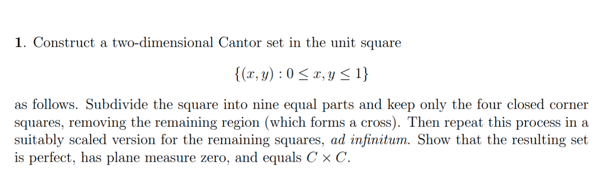
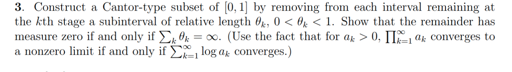
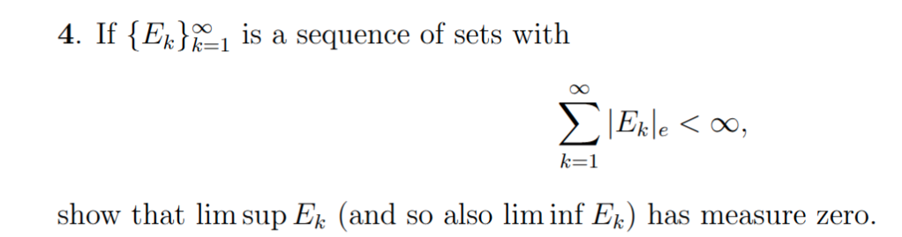
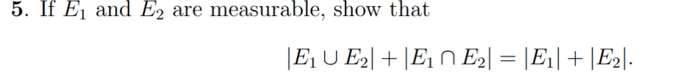
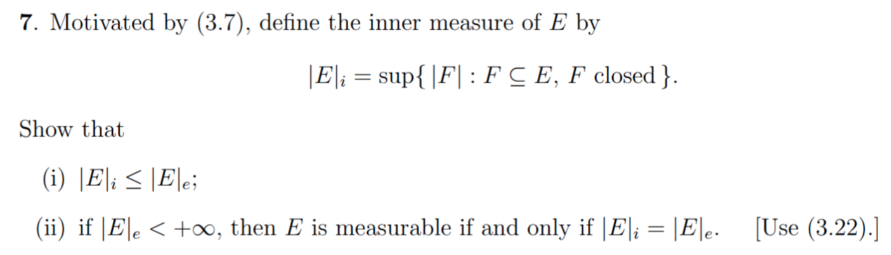

# Real Analysis Homework 01
b11201024 蔡平樂

I use $A-B$ to represent the notation $A\backslash B:=\{x|B\in A\cap x\notin B\}$ at the course, and the notation $A^c$ is represent the complement of $A$

Besides, if we type "Let $I=\{I_k\}_{k=1}^\infty$ be a collection of rectangles which covering $E$", it implies $E\subseteq \cup_{k=1}^\infty I_k$, not $E\subseteq I_k\forall k$
<!-- Besides, the following propositions  will being used at the exercises. -->
<!-- 
## Propositons of Cantor-type set
If there's an empty continuous interval (or polygon) in $[0,1]$(or $[0,1]^2$), then the interval is removed in one single construction step.

## Propositions of measurability
At following problems, we use the following propositions

#### 1. if $A$ measurable, then $A^c$ measurable
$\forall k\in\mathbb N, \exists G_k\supset A$ is open and $|G_k-A|_e \le \frac 1k$

$G_k$ is open $\implies G_k^c\subseteq A^c$ is closed and thus measurable
take $H=\cup_{k\in\mathbb N} G_k^c$ is measurable and $H\subseteq A^c$, then we have
$A^c-H\subseteq A^c-G^c_k\forall k\implies |A^c-H|_e\le |A^c-G_k|_e=|G_k-A|_e=\frac 1k$
$\implies |A^c-H|_e=0$, therefore which is measurable

$\implies A^c=\underbrace{A^c-H}_{measurable} \cup\underbrace{H}_{measurable}$ is measurable.

#### 2. if $A,B$ measurable, then $A\cap B$ measurable
$A,B$ measurable $\implies A^c,B^c$ measurable $\implies A^c\cup B^c$ measurable $\implies (A^c\cup B^c)^c=A\cap B$ measurable.

#### 3. if $A,B$ measurable, then $A-B$ measurable
$A-B=A\cap B^c$

#### 4.for any $A,B\subseteq \mathbb R^2$ satisfy $d(A,B)>0$, then $|A\cup B|_e=|A|_e+|B|_e$
- fix any $\epsilon>0$, choose collection of closed intervals $\mathbb I=\{I_k\}$ covers $A\cup B$, $\sum_{I_k\in I}\|I_k\|<\|A\cup B\|_e+\epsilon$,  and the diameter of each $I_k$ (defined as $\sup_{x,y\in I_k}d(x,y)$) is strictly smaller than $d(A,B)$, which can be completed by divide each $I_k$ into smaller intervals. 
- choose $I^1=\{I_k\in I|I_k\cap A\neq \emptyset\}$ and $I^2=\{I_k\in I|I_k\cap B\neq \emptyset\}$, then we can find that $I^1\cap I^2=\emptyset$, and $I^1,I^2$ covering $A,B$ respectively
- Therefore, $|A|_e+|B|_e\le \sum_{I_{1,k}\in I^1}|I_{1,k}| + \sum_{I_{2,k}\ in I^2}|I_{2,k}|=\sum_{I_k\in I}|I_k|\le |A\cup B|+\epsilon$
$\implies |A|_e+|B|_e \le |A\cup B|_e$, and it's trivially $|A|_e+|B|_e\ge |A\cup B|_e$, therefore $|A|_e+|B|_e=|A\cup B|_e$ for $d(A,B)>0$
 -->

## EX1.
<!--  -->
Let the set be $S$, and $S_n$ is the set after the $n^{th}$ construction step.

#### 1. perfect
If a node is an isolated point in $S$, WLOG suppose this node is not at the right or upper edge(otherwise we can flip the entire graph vertically or horizentally), then the square regions of its right, upper, and upper right corner squares are removed, these are a continuous polygon.
By the proposition of construction step, these three regions are removed at the same time.
However, it implies this node is the upper right corner node of an block in a certain step, and therefore it should not be an isolated point(consider the $ \lceil -\log_2 \epsilon \rceil+1$ step, it make sure there's at least one node close enouth with corner node of distance $<\epsilon$).

#### 2. measure zero
After the $n^{th}$ step of construction, the area of the set is $|S_n|=(\frac 49)^n$.

$|S|_e=|\cap_{n=1}^\infty S_n|_n\implies |S|_e\le |S_n|=(\frac 49)^n\forall n$
$\implies |S|_e=0$

#### 3. equal $C\times C$
consider the mapping $\mathbb R^2\to \mathbb R\times \mathbb R$ by $\phi((x,y))=(x,y)$, it will be a bijection between $S$ and $C\times C$

<!-- Let $B_\delta(x)=\{y\in [0,1]^2:|y-x|<\delta\ in\ L^2\ norm\}$

suppose $\exists x=(x_1,x_2)\in S$ is a isolated point, that is, $\exists \delta>0$ s.t. $B_\delta(x)\cap S=\emptyset$, 

let $k=\lceil -\log_3 \delta \rceil$, we have $3^k<\delta$,  -->

## EX2.
Let such set be $C_\delta$, and $C_\delta^k$ be the set after construction step $n$.
#### 1. perfect
Obviously, $0$ and $1$ is impossible to isolated, therefore we only discuss the nodes in $(0,1)$
if a node $a$ is isolated, then there's an interval $(a,b)\subseteq [0,1]$ is disjoint with $C_\delta$
By the proposition of Cantor-type set, $a$ is a rightmost point of an interval in a centain step of construction.

therefore, $a$ is impossible to be isolated, contradiction.

#### 2. measure
at the $n^{th}$ construction step, the volume of the set $C_\delta^n$ is $|C_{\delta}^n|=1-\sum_{k=1}^n 2^{k-1}\times (\delta 3^{-k})$
$=1-\frac 12 \delta \sum_{k=1}^n (\frac 23)^k$

Then from the nested proposition of the $C_{\delta}^n$, we have
$C_\delta=\liminf_{n\to\infty} C_\delta^n=\limsup_{n\to\infty} C_{\delta}^n$

With following proposition, we know that $|C_\delta|=\lim_{n\to\infty} |C_\delta^n|=1-\delta$

- if $A_1\supseteq A_2\supseteq ...$ are nested measurable sets, then $|\limsup_{n\to\infty} A_n|=\lim_{n\to\infty} |A_n|$:
    -    first, $\cup_{k=n}^{\infty} A_k=A_n$ is measurable, therefore $\limsup_{n\to\infty} A_n= \cap_{n=1}^\infty \cup_{k=n}^{\infty} A_k$ is measurable.
    - besides, $A_n-A=(A_n-A{n+1})\cup (A_{n+1}-A)=...=\cup_{k=n}^\infty (A_n-A_{n+1})$
    - $\implies |A_n-A|\le \sum_{k=n}^\infty |A_n-A_{n+1}|$
    - From $\infty>|A_1-A|\ge|A_{1}-A_2|+|A_2-A_3|+...+|A_{n-1}-A_n|$ we can find that $\sum_{k=n}^\infty |A_k-A_{k+1}|\to 0$ as $n\to\infty$, therefore $|A_n-A|\to 0$ as $n\to\infty$
    $\implies |A_n|-|A|<|A_n-A|\to 0$ as $n\to\infty$

#### 3. contain no intervals
We can easily seen that after the $n^{th}$ step, there's no any continuous intervals with length greater than $2^{-n}$ in $C_\delta^n$

Therefore, the length of the intervals in $C$ will not greater than $\inf_{n}2^{-n}=0$

i.e. there's no interval contained in $C_\delta$
<!-- - first, $\cup_{k=n}^{\infty} C^k_\delta=C_\delta$ is measurable, therefore $\limsup_{n\to\infty} C_\delta^n= \cap_{n=1}^\infty \cup_{k=n}^{\infty} C^k_\delta$ is measurable.
besides, $|C^n_\delta-C_\delta|=|C_\delta^n-\cap_{k=1}^\infty C_\delta^k|=|\cup_{k=n}^\infty(C_\delta^n- C_\delta^k)|\le \sum_{k=n}^\infty |C_\delta^n-C_\delta^k|=\sum_{k=n}^\infty 2^{k-1}\delta{3^{-k}}\le \frac 12 \times (\frac {2}3)^n \delta\frac{1}{1-\frac 32}\to 0$ as $n\to\infty$
$\implies \lim_{n\to\infty} |C^n_\delta| \le |C_\delta| + \lim_{n\to\infty}|C^n_\delta-C_\delta|=|C_\delta|$ -->

<!-- $\implies |C_\delta| = \lim_{n\to\infty} 1-\frac 12 \delta \sum_{k=1}^n (\frac 23)^k=1-\delta$ -->

<!-- - if $A_1\supseteq A_2\supseteq ...$ are nested measurable sets, then $|\limsup_{n\to\infty} A_n|=|\liminf_{n\to\infty} A_n|=\lim_{n\to\infty} |A_n|$
first, $\cup_{k=n}^{\infty} A_k=A_n$ is measurable, therefore $\limsup_{n\to\infty} A_n= \cap_{n=1}^\infty \cup_{k=n}^{\infty} A_k$ is measurable.
besides, $A_n-A=(A_n-A{n+1})\cup (A_{n+1}-A)=...=\cup_{k=n}^\infty (A_n-A_{n+1})$
$\implies |A_n-A|\le \sum_{k=n}^\infty |A_n-A_{n+1}|$
From $\infty>|A_1-A|=|A_{1}-A_2|+|A_2-A_3|+...+|A_{n-1}-A_n|$ we can find that $\sum_{k=n}^\infty |A_k-A_{k+1}|\to 0$ as $n\to\infty$, therefore $|A_n-A|\to 0$ as $n\to\infty$
$\implies |A_n|-|A|<|A_n-A|\to 0$ as $n\to\infty$ -->

## EX3.
<!--  -->
From the description,
- after the first step, there's $2$ intervals of length $\frac{1-\theta_1}{2}$
- after the second step, there's $4$ intervals of length $\frac{1-\theta_1}{2}\times \frac{1-\theta_2}{2}$
...
- after the $n^{th}$ step, there's $2^n$ intervals of length $\Pi_{k=1}^n\frac{1-\theta_k}{s2}=2^{-n}\times \Pi_{k=1}^n (1-\theta_k)$

The remainder has nonzero measure\
$\iff \limsup_{n\to\infty} 2\times 2^{-n}\times \Pi_{k=1}^n (1-\theta_k)\stackrel{each\ terms\in(0,1)}=\Pi_{n=1}^\infty (1-\theta_n)$ converge to a nonzero value\
$\iff \sum_{n=1}^\infty \log(1-\theta_k)$ converge
($\iff \sum_{n=1}^\infty -\log(1-\theta_k)$ converge)

Then we can find that
- if $\sum_{n=1}^\infty \log(1-\theta_k)$ converge, from $0\le \theta_n\le -\log(1-\theta_n)$, $\sum_{n=1}^\infty \theta_n$ converge.
- if $\sum_{n=1}^\infty \theta_n$ converge, then $\lim_{n\to\infty} \theta_n=0$
from $\log(1-x)\simeq -x$ for small $N$, we can find that $\sum_{n=1}^\infty \log(1-\theta_n)$ converge

Therefore, the remainder has measure zero $\iff \sum_{n=1}^\infty \theta_n$ not converge, i.e. $\sum_{n=1}^\infty \theta_n=\infty$

## EX4.
<!--  -->

Let $E = \limsup_{n\to\infty} E_n = \cap_{n=1}^\infty \cup_{k\ge n}E_k$

By definition, $|E|_e = |\cap_{n=1}^\infty \cup_{k\ge n}E_k|\le|\cup_{k\ge n} E_k|_e\le \sum_{k=n}^\infty |E_k|_e\forall n\in\mathbb N$

because $|E_k|_e\ge 0\forall k$, therefore $\sum_{k=1}^\infty |E_k|_e<\infty$ implies $\sum_{k=1}^\infty |E_k|_e$ converge
$\implies \forall \epsilon>0, \exists N\in\mathbb N$ s.t. $\sum_{k=n}^\infty |E_k|_e<\epsilon\forall n\ge N$

$\implies |E|_e<\epsilon \forall \epsilon>0\implies |E|_e=0$
therefore, $E=\limsup_{n\to\infty} E_n$ has measure zero.

for the $\liminf$ case, define $I=\liminf_{n\to\infty} E_n=\cup_{n=1}^\infty \cap_{k=n}^\infty E_k$ and fix $\epsilon>0$, 

$|I|_e=|\cup_{n=1}^\infty \cap_{k=n}^\infty E_k|\le \sum_{n=1}^\infty |\cap_{k=n}^\infty E_k|_e$

note that $|\cap_{k=n}^\infty E_k|\le |E_m|\forall m\ge n$
For each $n$, choose $N_n$ s.t. $|E_k|<\epsilon\times 2^{-n}\forall k\ge N_n$ (it always exist from the fact $\sum_{n=1}^\infty |E_k|_e$ converge)
then we have $|\cap_{k=n}^\infty E_k|\le \epsilon\times 2^{-k}$
$\implies |I|_e\le \sum_{n=1}^\infty \epsilon2^{-n}=\epsilon\forall \epsilon>0$

$\implies |I|_e=0$, i.e. $\liminf_{n\to\infty} E_n$ has measure zero.

## EX5.
<!--  -->

first, consider the situation that $E_1,E_2$ are disjoint.
$|E_1\cup E_2|\le |E_1|+|E_2|$ is obvious, then we will prove the part $|E_1\cup E_2| \ge |E_1|+|E_2|$

By EX7-ii-1, $\exists A\subseteq E_1,B\subseteq E_2$ s.t. $A,B$ are closed and $|A|_e\ge |E_1|-\epsilon, |B|_e\ge |E_2|-\epsilon$

$A,B$ closed and dosjoint $\implies d(A,B)>0$

Therefore, $|E_1\cup E_2|\ge |A\cup B|=|A|+|B|\ge |E_1|+|E_2|-2\epsilon$

$\implies |E_1\cup E_2|\ge |E_1|+|E_2|\implies |E_1\cup E_2|=|E_1|+|E_2|$

For $E_1\cap E_2\neq \emptyset$, because $E_2-E_1,E_1\cap E_2$ are measurable by proposition of measurability 2 and 3, therefore
- $|E_1\cup E_2| = |E_1\cup (E_2-E_1)|=|E_1|+|E_2-E_1|$
- $|E_2|=|(E_2-E_1)\cup (E_2\cap E_1)|=|E_2-E_1|+|E_2\cap E_1|$

$\implies |E_1\cup E_2|+|E_1\cap E_2|=|E_1|+|E_2-E_1|+|E_2|-|E_2-E_1|=|E_1|+|E_2|$

<!-- At the course we have known that $E_1\cup E_2$ is measurable
for $E_1\cap E_2$, we can also prove its measurable: -->

<!-- suppose $E_1,E_2$ are disjoint, i.e. $E_1\cap E_2=\emptyset$ with measure $0$

$|E_1\cup E_2| \le |E_1| + |E_2|$ is trivial from the definition

fix $\epsilon>0$, choose $I=\{I_{k}\}_{k=1}^\infty,J=\{J_k\}_{k=1}^\infty$ which are collection of closed cubes covering $E_1,E_2$ respectively, and satisfy $\sum_{k=1}^\infty |I_k|-|E_1|<\epsilon, \sum_{k=1}^\infty |J_k|-|E_2|<\epsilon$

choose $\{I^*_k\}$, $\{J^*_k\}$ collection of ***open*** cubes satisfying
- $I^*_k\supset I_k, J^*_k \supset J_k$
- $|I_k^*|\le |I_k|+2^{-k}\epsilon,|J^*_k|\le |J_k|+2^{-k}\epsilon$

from the property of open sets, we can find a finite number of cubes $I^*=\{I^*_k\}_{k=1}^{N_1},J^*=\{J^*_k\}_{k=1}^{N_2}$ to cover $$

Let $T = \left( \cup_{k=1}^\infty I^*_k \right)\cap \left( \cup_{k=1}^\infty J^*_k \right)$, 

choose $G_1,G_2$ -->
<!-- then $G_1\cap G_2$ are open, covering $E_1\cap E_2$, and 
$G_1\cap G_2-E_1\cap E_2 \subset (G_1-E_1)\cup(G_2-E_2)$
$\implies |G_1\cap G_2-E_1\cap E_2|_e\le |G_1-E_1|_e+|G_2-E_2|_e=\epsilon$
$\implies E_1\cap E_2$ is measurable -->
## EX6.
fix $\epsilon>0$
Let $G_1,G_2$ are open sets covering $E_1,E_2$ respectively, $|G_1-E_1|_e<\epsilon,|G_2-E_2|_e<\epsilon$

Let $I^1=\{I^1_k\},I^2=\{I^2_k\}$ be collection of intervals which covering $G_1-E_1,G_2-E_2$ respectively with $\sum_{A\in I^1}|A|<\epsilon, \sum_{B\in I^2}|B|<\epsilon$

Take $G=G_1\times G_2$, the direct product of open sets is open, and $I^1\times I^2=\{A\times B:A\in I^1,B\in I^2\}$ can cover $G-E_1\times E_2$

Therefore, we have
$|G-E_1\times E_2|_e\le |I^1\times I^2|=\sum_{A\in I^1,B\in I^2}|A\times B|=\sum_{A\in I^1}|A|\times \sum_{B\in I^2}|B|\le \epsilon^2$

hence, we can always find $G\supseteq E_1\times E_2$ s.t. $|G-E_1\times E_2|_e<\epsilon^2\forall \epsilon^2>0$, by definition $E_1\times E_2$ is measurable.

For the case $|E_1|=\infty,|E_2|=\infty$, the equality is trivial.

For the cases $|E_1|,|E_2|<\infty$,
Let $G_1=\cup_{k=1}^\infty U_k,G_2=\cup_{k=1}V_k$, where each $U_k,V_k$ are closed intervals, then
$G=\{U_i\times V_j:i,j\in\mathbb N\}$, and each $U_i,V_j$ are disjoint except the edge.

Because the edge of the rectangle has measure zero, therefore
$|G|=\sum_{i,j\in\mathbb N}|U_i|\times |V_j|$\
$\stackrel{\rm both\ positive\ and\ converge}=(\sum_{i=1}^\infty |U_i|)(\sum_{j=1}^\infty |V_j|)=|G_1|\times |G_2|$

$|E_1|\times |E_2|\le |G_1|\times |G_2|\le |E_1|\times |E_2|+(|E_1|+|E_2|)\epsilon+\epsilon^2$

$\implies |G|-|G-E_1\times E_2|\le |E_1\times E_2|\le |G|$
$\implies |E_1|\times |E_2|-\epsilon^2\le |E_1\times E_2|\le |E_1|\times |E_2|+\epsilon(\epsilon+2|E_1|+2|E_2|)\forall \epsilon>0$

$\implies |E_1\times E_2|=|E_1|\times |E_2|$

For the case $|E_1|=0,|E_2|=\infty$, fix $\epsilon>0$, Let $I^n = \{I^n_{k}\}_{k=1}^\infty$ be a collection of intervals which covering $E_1$ and $\sum_{k=1}^\infty |I^n_k|<\frac \epsilon{n^2}$

Besides, Let $J=\{J_k\}_{k=1}^\infty$ with $J_k=[-k-1, -k]\cup[k,k+1]$, then $J$ will covering $\mathbb R\supseteq E_2$

Let $I=\{I^n_k\times J_n|n\in\mathbb N,k\in\mathbb N\}$, then $I$ will be a collection of rectangles, covering $E_1\times E_2$, and therefore 
$|E_1\times E_2|\le \sum_{A\in I} |A|\le \sum_{n=1}^\infty \sum_{k=1}^\infty |I^{n}_k \times J_n|=\sum_{n=1}^\infty \sum_{k=1}^\infty |I^{n}_k|\le \sum_{n=1}^\infty \frac{\epsilon}{n^2}=\epsilon \sum_{n=1}^\infty \frac 1{n^2}\le 2\epsilon$ for any $\epsilon>0$

Therefore, $|E_1\times E_2|=0$

## EX7.
<!--  -->

#### i.
$\forall \epsilon>0$,  choose $H\in G_\delta$ s.t. $H\supset E$ and $|E|_e=|H|_e$, from definition $F\subset H\forall F\subset E$
$\implies |F|<|H|\forall F\subset E$
$\implies \sup_{F:F\subset E,F\ closed}|F|\le |H|_e=|E|_e$

#### ii.
<!-- ref. Lemma 3.22 of textbook -->
<!-- Using EX5, if $A,B\subset\mathbb R^n$ are measurable and disjoint, then $|A\cup B|=|A|+|B|$ -->
We separate the proof into two parts,

###### ii-1
$E$ measurable $\implies E^c$ measurable $\implies\forall \epsilon>0 \exists G\supseteq E^c$ s.t. $|G-E^c|_e<\epsilon$
$G$ open $\implies G^c$ closed.
besides, $|E-G^c|_e=|E\cap (G^c)^c|_e=|G\cap (E^{c})^c|=|G-E|_e<\epsilon$, $G^c\subset (E^c)^c=E$
$\implies G^c$ closed, contained in $E$ and $|G^c|_e\ge |E|-|E-G^c|_e\ge |E|-\epsilon$

$\implies \sup_{A\subseteq E,A\ closed}|A|_e=|E|$

###### ii-2
(Ex5 is depend on ii-1, but ii-1 does not depend on ii-2, so it would not cause the circular justification)
Fix $\epsilon>0$
$|E|_i=|E|_e=v\implies\exists F\subseteq E$ closed and $G\supseteq E,G\in G_\delta$ open s.t. $|F|>v-\epsilon,|G|_e<v+\epsilon$
$\implies |E-F|\ge |E|-|F|\le \epsilon,|G-E|\ge$
$F,G$ measurable $\implies G-F$ measurable and $F,G-F$ disjoint
$\implies |G-F|_e=|G|_e-|F|_e\le v+\epsilon-(v-\epsilon)=2\epsilon$
$G-E\subset G-F\implies |G-E|_e>|G-F|_e=2\epsilon$

$\implies E$ is measurable

<!-- $E$ is measurable $\implies E^c$ measurable $\implies \exists G\supset E^c$ is open s.t. $|G-E^c|_e<\epsilon$
- $G-E^c=G\cap (E^{c})^c=E\cap G=E\cap (G^{c})^{c}=E-G^c$

$\implies |E-G^c|_e<\epsilon$
besides, $G\supset E^c$ is open $\implies G^c\subset E$ is closed

$\implies \forall \epsilon>0,\exists F\subset E$ is closed and $|E-F|<\epsilon$
$E,F,E-F$ measurable $\implies |F|=|E|-|E-F|\ge |E|-\epsilon$
$\implies |E|_i=\sup_{F\subseteq E:F\ closed}|F|=|E|=|E|_e$ -->

<!-- $F$ closed $\implies F$ measurable,
choose $G'\supset F$ s.t. $|G'-F|_e<\epsilon$

Let $G''=G\cup G'$, then $|G''-E|_e=|G\cup G'-E\cup F|$ -->

<!-- Choose a collection of cubes $\{I_k\}_{k=1}^\infty$ covers $F$ with $\sum_{k=1}^\infty |I_k|\le |F|+\epsilon$, and collection of cubes $\{J_k\}$ covers $G$ with $\sum_k |J_k|\le |G|+\epsilon$ -->
